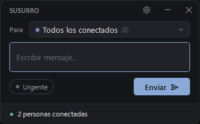
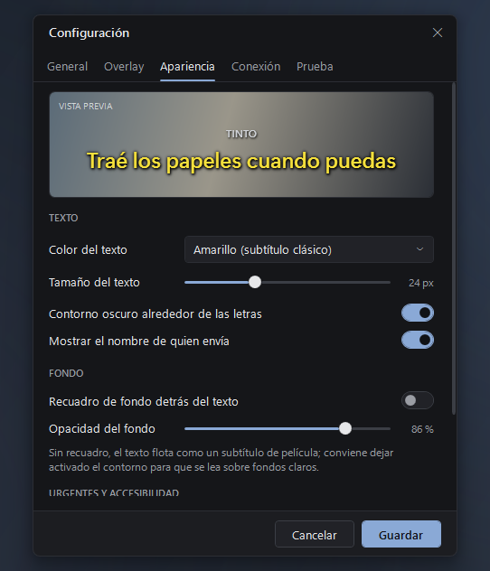
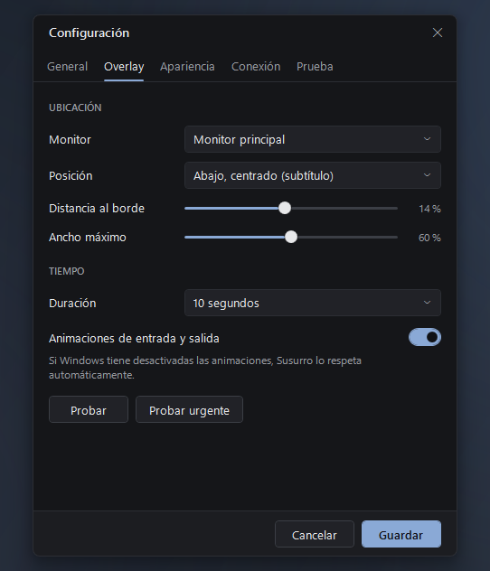
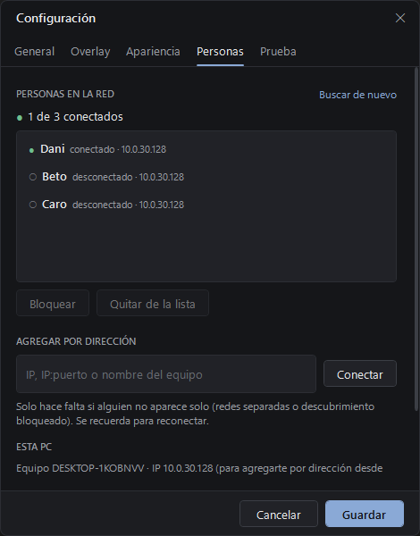
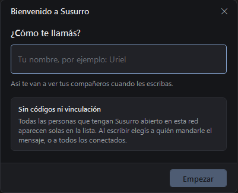

<div align="center">


<br>


**Mensajes breves entre las PCs de la oficina, que aparecen como un subtítulo discreto.**<br>
Sin servidor · sin nube · sin cuentas · sin códigos · sin sonidos · sin robar el foco

<a href="https://github.com/TintoUriel/Susurro/releases/latest"></a>

[Características](#características) · [Capturas](#capturas) · [Inicio rápido](#inicio-rápido) · [Documentación](#índice)

</div>

---

<p align="center">
  
</p>

Elegís a quién (o a todos los conectados), escribís y, en su PC, el mensaje aparece unos segundos
**por encima de todo**, como un subtítulo. Quien lo recibe puede seguir escribiendo en Word, en el navegador o en Visual Studio:
Susurro **no toma el foco, no captura el mouse ni el teclado, no aparece en Alt+Tab** y los clics lo atraviesan.

<table>
  <tr>
    <td width="50%" valign="top">
      
    </td>
    <td width="50%" valign="top">

**Una utilidad pequeña, no una aplicación empresarial.**

- <kbd>Ctrl</kbd>+<kbd>Shift</kbd>+<kbd>Espacio</kbd> desde **cualquier programa** abre Susurro listo para escribir
- **Para:** una persona o todos los conectados · <kbd>Ctrl</kbd>+<kbd>↑</kbd>/<kbd>↓</kbd> cambia mientras escribís
- <kbd>Enter</kbd> envía y te devuelve a lo que estabas · <kbd>Ctrl</kbd>+<kbd>U</kbd> urgente · <kbd>Esc</kbd> oculta
- Máximo 300 caracteres; el campo se limpia y conserva el foco
- `Enviado` → `Entregado ✓` → `Visto ✓`
- Vive en la bandeja del sistema y arranca con Windows
- No guarda historial de mensajes

</td>
  </tr>
</table>

## Características

| | |
|---|---|
| ⌨️ **Atajo global** | <kbd>Ctrl</kbd>+<kbd>Shift</kbd>+<kbd>Espacio</kbd> desde cualquier programa: escribís, <kbd>Enter</kbd>, y volvés a lo que estabas. Configurable. |
| 🪶 **Liviano de verdad** | 0 % de CPU en reposo (sin sondeo ni bucles), ~9 MB residentes en la bandeja, configuración de pocos KB. |
| 👥 **Toda la oficina** | Cada persona con Susurro en la red aparece sola en la lista. Le escribís a una o a todos los conectados. |
| 🙋 **Tu nombre, no el de la PC** | La primera vez te pregunta cómo te llamás; así te ven los demás. Sin códigos ni vinculación. |
| 🔌 **Directo por la LAN** | Las PCs se hablan entre sí por TCP. Sin servidor central, sin internet, sin base de datos. |
| 🔎 **Se encuentran solas** | Descubrimiento automático por UDP; si cambia la IP, se vuelven a encontrar por su identificador. |
| 🔁 **Reconexión automática** | PC apagada, reiniciada, suspendida o red caída: se reconecta sola y entrega lo que quedó en espera. |
| 🔐 **Seguro sin contraseñas** | Cada PC tiene una identidad de clave pública (su id es el hash de la clave): nadie puede hacerse pasar por otra. Autenticación mutua y AES-256-GCM. Podés bloquear a quien quieras. |
| 🎬 **Overlay tipo subtítulo** | Posición, monitor, duración, tamaño, color (blanco / amarillo / gris), recuadro opcional y contorno de letras. |
| ⚡ **Urgentes discretos** | Una diferencia visual sutil (borde ámbar, negrita o fondo cálido), nunca sonidos ni ventanas emergentes. |
| 🖥️ **Multimonitor y DPI** | Monitor automático, principal o específico; nítido al 100, 125, 150 y 200 %; el texto nunca se corta. |
| ♿ **Accesible** | Tamaño de fuente, alto contraste, animaciones desactivables; respeta la configuración de Windows. |

## Capturas

<table>
  <tr>
    <td align="center" width="50%">
      <br>
      <sub><b>Estilo cine</b> — amarillo, sin recuadro y con contorno</sub>
    </td>
    <td align="center" width="50%">
      <br>
      <sub><b>Urgente</b> — distinto, pero igual de discreto</sub>
    </td>
  </tr>
  <tr>
    <td align="center">
      <br>
      <sub><b>Apariencia</b> con vista previa en vivo</sub>
    </td>
    <td align="center">
      <br>
      <sub><b>Overlay</b> — monitor, posición y duración</sub>
    </td>
  </tr>
  <tr>
    <td align="center">
      <br>
      <sub><b>Personas</b> — se encuentran solas; bloquear o agregar por dirección</sub>
    </td>
    <td valign="middle">

### Inicio rápido

1. Descargá [**Susurro.exe**](https://github.com/TintoUriel/Susurro/releases/latest) y abrilo en **cada PC**.
2. Escribí tu nombre y tocá **Empezar**.
3. Listo: tus compañeros aparecen solos en **Para:**. Sin códigos.



Detalles en [Cómo instalar](#5-cómo-instalar) y [Cómo empezar](#6-cómo-empezar-tu-nombre-y-tus-compañeros).

</td>
  </tr>
</table>

---

## Índice

1. [Qué es Susurro](#características)
2. [Arquitectura](#2-arquitectura)
3. [Cómo compilar](#3-cómo-compilar)
4. [Cómo publicar](#4-cómo-publicar)
5. [Cómo instalar](#5-cómo-instalar)
6. [Cómo empezar: tu nombre y tus compañeros](#6-cómo-empezar-tu-nombre-y-tus-compañeros)
7. [Firewall de Windows](#7-firewall-de-windows)
8. [Cómo funciona el descubrimiento](#8-cómo-funciona-el-descubrimiento)
9. [Cómo funciona la reconexión](#9-cómo-funciona-la-reconexión)
10. [Cómo cambiar el puerto](#10-cómo-cambiar-el-puerto)
11. [Solución de problemas de conexión](#11-solución-de-problemas-de-conexión)
12. [Dos instancias en la misma PC (desarrollo)](#12-dos-instancias-en-la-misma-pc-desarrollo)

Anexos: [Uso](#uso) · [Overlay](#el-overlay) · [Configuración](#configuración) · [Rendimiento](#rendimiento)
· [Tests](#tests) · [Decisiones técnicas](#decisiones-técnicas) · [Protocolo](docs/PROTOCOL.md) · [Identidad y seguridad](docs/IDENTIDAD.md)

---

## 2. Arquitectura

```
Susurro.sln
├─ src/Susurro.Core          (net8.0, sin UI — probado con tests)
│  ├─ Config/       AppSettings, SettingsValidator, SettingsStore (JSON atómico)
│  ├─ Logging/      Log + FileLogSink (256 KB con rotación)
│  ├─ Protocol/     Packet, FrameIO, SecureChannel (AES-GCM), HandshakeCrypto, JSON con source-gen
│  ├─ Identity/     LocalIdentity (clave ECDH P-256, id = hash de la clave, clave de enlace), DPAPI
│  ├─ Discovery/    DiscoveryService (UDP multicast + broadcast)
│  ├─ Net/          PeerLink (contactos, conexiones, reconexión, bandeja por destinatario), PeerSession, SessionArbiter, Backoff
│  └─ Messaging/    MessageRules, DuplicateFilter, DisplayQueue, WhisperMessage
├─ src/Susurro.App           (net8.0-windows, WPF)
│  ├─ AppController.cs  une todo; pasa eventos de red al hilo de UI
│  ├─ Overlay/      OverlayHost (HwndSource Win32), SubtitleVisual, OverlayController, MonitorService
│  ├─ Tray/         TrayIcon (Shell_NotifyIcon nativo, sin WinForms)
│  ├─ Views/        MainWindow, SettingsWindow, WelcomeWindow, LogWindow
│  ├─ Services/     AutoStart (HKCU\Run), SingleInstance, CommandLine, WindowStyling, MemoryTrimmer
│  └─ Themes/Dark.xaml  todo el estilo propio (sin frameworks visuales)
├─ tests/Susurro.Core.Tests  (xUnit)
├─ installer/Susurro.iss     (Inno Setup → SusurroSetup.exe)
├─ scripts/                  build, dos instancias, instalación portátil, firewall, icono
└─ docs/                     PROTOCOL.md, IDENTIDAD.md
```

Flujo de un mensaje:

```
MainWindow ─Send(para)→ AppController ─→ PeerLink.Send (una copia por destinatario) ─→ bandeja de salida ─→ PeerSession (AES-GCM/TCP)
                                                                               │ LAN
PeerSession ─→ PeerLink (valida, descarta duplicados, ack) ─→ AppController ─→ OverlayController
                                                                      └─→ OverlayHost (subtítulo)
```

`Susurro.Core` no depende de WPF: toda la lógica de red, protocolo, identidad, contactos, cola y
configuración se prueba con tests, incluidas conexiones TCP reales entre dos instancias.

## 3. Cómo compilar

Requisitos: Windows 10/11 y el **SDK de .NET 8** (`winget install Microsoft.DotNet.SDK.8`).

```bash
dotnet build Susurro.sln
```

```bash
dotnet build Susurro.sln -c Release
```

```bash
dotnet test tests/Susurro.Core.Tests
```

Ejecutable de Debug: `src/Susurro.App/bin/Debug/net8.0-windows/Susurro.exe`.

## 4. Cómo publicar

Publicación final **autocontenida** (no requiere instalar .NET en las PCs):

```bash
dotnet publish src/Susurro.App -c Release -p:PublishProfile=win-x64
```

Resultado: **un único** `artifacts/publish/win-x64/Susurro.exe` (~140 MB, con el runtime de .NET
incluido). Se puede copiar tal cual a otra PC y ejecutar.

> ¿Por qué sin comprimir? Comprimido pesaría ~64 MB, pero medido en reposo usa el doble de memoria
> privada (110 MB contra 53 MB), porque descomprime los ensamblados en memoria. Se prioriza el consumo.

Todo en un paso (tests + publicación + zip portátil + instalador si está Inno Setup):

```bash
powershell -ExecutionPolicy Bypass -File scripts/build.ps1
```

> Alternativa mínima: si las PCs ya tienen el *.NET 8 Desktop Runtime*, se puede publicar
> dependiente del framework (~1 MB):
> `dotnet publish src/Susurro.App -c Release -r win-x64 --self-contained false -o artifacts/fdd`

## 5. Cómo instalar

**La forma más simple — un solo `.exe`**: descargá `Susurro.exe` desde
[Releases](https://github.com/TintoUriel/Susurro/releases/latest), guardalo en una carpeta fija
(por ejemplo `C:\Programas\Susurro\`) y abrilo. No necesita instalar nada más: la primera vez
pregunta tu nombre y queda configurado para iniciar con Windows.

> Windows puede mostrar *"Windows protegió tu PC"* porque el ejecutable no está firmado
> digitalmente: **Más información → Ejecutar de todas formas**. Y la primera vez, el aviso del
> Firewall: **Permitir** (ver [sección 7](#7-firewall-de-windows)).

**Opción A — instalador** (`artifacts/installer/SusurroSetup.exe`, generado por `scripts/build.ps1`
si tenés [Inno Setup 6](https://jrsoftware.org/isdl.php)):

- Instala en *Archivos de programa*, crea el acceso directo del menú Inicio (y opcional el de escritorio).
- Opciones: *Iniciar con Windows* (marcada), *Permitir en el Firewall* (marcada).
- Se desinstala desde *Configuración de Windows → Aplicaciones*; quita la regla de firewall, el
  inicio automático y, si lo confirmás, la configuración.

**Opción B — script de instalación** (junto a `Susurro.exe`, desde `scripts/`): ejecutar

```bash
powershell -ExecutionPolicy Bypass -File install-portable.ps1 -AutoStart -Firewall
```

Se instala en `%LOCALAPPDATA%\Programs\Susurro` y aparece en *Aplicaciones instaladas* para
desinstalarlo (`install-portable.ps1 -Uninstall`).

**Inicio con Windows**: viene **activado**. Windows inicia → Susurro arranca oculto en la bandeja
→ se conecta solo. Se desactiva en *Configuración → General → Iniciar con Windows*.

## 6. Cómo empezar: tu nombre y tus compañeros

1. La primera vez que se abre Susurro pregunta **¿Cómo te llamás?** Ese es el nombre que ven los
   demás (se cambia en *Configuración → General → Tu nombre*). Hasta elegirlo, Susurro no sale a la red.
2. Todas las PCs con Susurro abierto en la misma red se encuentran solas en segundos y aparecen en
   **Para:** de la ventana principal, con un punto verde si están conectadas.
3. Elegí a una persona o **Todos los conectados**, escribí y <kbd>Enter</kbd>. Susurro recuerda a
   quién le escribiste la última vez.

No hay códigos ni vinculación. En *Configuración → Personas* está la lista completa, y desde ahí se
puede **bloquear** a alguien (no puede conectarse ni enviarte mensajes), **quitar** PCs que ya no se
usan o **agregar por dirección** a alguien que no aparece solo.

Cómo se evita que alguien se haga pasar por otro, y qué no cubre: [docs/IDENTIDAD.md](docs/IDENTIDAD.md).

## 7. Firewall de Windows

Susurro necesita recibir conexiones entrantes en **TCP 47810** y **UDP 47811**.

- El **instalador** crea una regla por programa (redes privadas y de dominio).
- Sin instalador, la primera vez Windows pregunta *"¿Quieres permitir que las redes… accedan a esta
  aplicación?"* → **Permitir** (al menos en redes privadas).
- Manual (PowerShell como administrador):

```bash
powershell -ExecutionPolicy Bypass -File scripts/firewall.ps1 -Exe "C:\Program Files\Susurro\Susurro.exe"
```

- Si la red de la oficina está marcada como **Pública**, cambiala a *Privada* (Configuración →
  Red e Internet → propiedades de la red) o usá `-AllProfiles` / la opción "También en redes públicas".

## 8. Cómo funciona el descubrimiento

- Cada Susurro escucha en **UDP 47811** (multicast `239.255.77.77` y broadcast). Escuchar no consume
  CPU: la recepción es asíncrona.
- **No hay tráfico periódico**. Solo se envía:
  - un *anuncio* al iniciar, al cambiar la red, al volver de suspensión o al cambiar tu nombre;
  - una *consulta* (3 datagramas en 1,5 s) al iniciar, al cambiar la red, con *Buscar de nuevo* o
    cuando hay un mensaje esperando a alguien que no aparece.
- Las respuestas incluyen `InstanceId`, nombre y puerto TCP. Esa información **no es confiable**:
  solo aporta direcciones candidatas; la identidad se verifica criptográficamente al conectar.
- Una PC nueva se agrega a la lista recién después de verificar su identidad por TCP.
- Si el descubrimiento no funciona en tu red (VLAN distintas, multicast bloqueado), agregá a la
  persona con su IP o nombre de equipo en *Configuración → Personas → Agregar por dirección*.

## 9. Cómo funciona la reconexión

- Cualquiera de las dos PCs de cada par puede iniciar la conexión; si ambas lo hacen a la vez, una
  regla determinista elige la misma en los dos lados.
- Cada compañero tiene su propio intento de conexión, **dormido** hasta que haya un motivo: arranque
  (un intento con su última dirección), su *anuncio* al encenderse, un cambio de red o la vuelta de
  suspensión, un mensaje esperando para esa persona o *Buscar de nuevo*.
- Si se pierde una conexión sin aviso, o hay mensajes esperando, se reintenta con esperas crecientes
  **1, 2, 5, 10, 20, 30, 60 s**. Si la otra PC avisó que se cerraba, no se insiste: vuelve a
  aparecer sola cuando se enciende.
- **Cambio de IP**: la identidad es el `InstanceId`, no la IP; el descubrimiento encuentra la nueva
  dirección y la guarda como "última conocida".
- **Detección de caída**: `bye` inmediato si la otra PC cierra Susurro o Windows; latido solo si
  hay 30 s sin tráfico; conexión muerta tras 75 s sin respuesta.
- Los mensajes enviados sin conexión esperan hasta 2 minutos y se entregan al reconectar.

Detalle completo: [docs/PROTOCOL.md](docs/PROTOCOL.md).

## 10. Cómo cambiar el puerto

*Configuración → Personas → Puerto TCP* → Guardar. La comunicación se reinicia sola.

- Cada PC puede usar su propio puerto: las demás lo aprenden al conectarse o por descubrimiento.
- Si el descubrimiento no funciona y cambiaste el puerto, agregala por dirección con `IP:puerto`.
- La regla de firewall del instalador es **por programa**, así que sigue valiendo con otro puerto.
- Desde la línea de comandos: `Susurro.exe --port 50000` (se guarda). El UDP de descubrimiento se
  cambia con `--discovery-port` (debe ser el mismo en ambas PCs).

## 11. Solución de problemas de conexión

| Síntoma | Qué hacer |
|---|---|
| **Nadie aparece** en *Para:* | ¿Está Susurro abierto en las otras PCs? ¿Están en la misma red? Probá *Configuración → Personas → Buscar de nuevo*. |
| Alguien aparece **desconectado** | Se reconecta solo cuando abre Susurro. Si sigue así, revisá su firewall ([sección 7](#7-firewall-de-windows)). |
| "Responde, pero el puerto TCP no es accesible (¿firewall?)" | Falta la regla de firewall en esa PC ([sección 7](#7-firewall-de-windows)). |
| "No acepta conexiones de esta PC" | Esa persona te bloqueó (o te quitó y bloqueó). |
| "El puerto 47810 está en uso por otro programa" | Cambiá el puerto ([sección 10](#10-cómo-cambiar-el-puerto)). |
| Alguien no aparece nunca (redes separadas) | Multicast/broadcast bloqueado: agregalo por dirección (su IP está en *Configuración → Personas → Esta PC*). |
| "La otra PC tiene una versión incompatible" | Actualizá Susurro en todas las PCs: la versión con códigos no se conecta con esta. |
| Se conecta y se desconecta | Revisá el registro: *Configuración → Prueba → Ver registro*. |
| Pruebas rápidas | `Test-NetConnection <IP> -Port 47810` desde PowerShell en la otra PC. |

El registro (`%LOCALAPPDATA%\Susurro\logs\susurro.log`, máx. ~512 KB con rotación) anota inicio,
contactos nuevos, conexión, desconexión, errores y envío/recepción de mensajes (sin su contenido).

## 12. Dos instancias en la misma PC (desarrollo)

Cada **perfil** tiene su configuración, identidad, contactos, registro e instancia única propios:

```bash
powershell -ExecutionPolicy Bypass -File scripts/run-two-instances.ps1
```

Equivale a:

```bash
Susurro.exe --profile A --port 47820
```

```bash
Susurro.exe --profile B --port 47830
```

Ambas comparten el UDP 47811, así que se encuentran solas en cuanto cada una tiene nombre. Para
simular una oficina se pueden abrir más perfiles (`--profile C --port 47840`, …).
`-Reset` borra los perfiles para empezar de cero.
Los perfiles de desarrollo no se agregan al inicio de Windows.

---

## Uso

**Atajo global**: <kbd>Ctrl</kbd>+<kbd>Shift</kbd>+<kbd>Espacio</kbd> abre Susurro desde cualquier programa con el
cursor en el campo de texto. <kbd>Enter</kbd> envía, la ventana se oculta y el foco vuelve a la aplicación
en la que estabas (si no hay conexión, queda visible mostrando "En espera"). <kbd>Esc</kbd> o volver a
apretar el atajo cancela. Se cambia o desactiva en *Configuración → General → Atajo de teclado*: hacé
clic en el campo y apretá la combinación; si Windows u otro programa ya la usa, Susurro avisa
(por ejemplo, <kbd>Win</kbd>+<kbd>Espacio</kbd> está reservado por Windows para cambiar el idioma del teclado).
Usa `RegisterHotKey`: no hay ganchos de teclado ni se lee ninguna otra tecla.

**Para quién**: el selector **Para:** lista a tus compañeros (● conectado, ○ desconectado) y, si hay
más de uno, **Todos los conectados**. <kbd>Ctrl</kbd>+<kbd>↑</kbd>/<kbd>↓</kbd> cambia de destinatario sin
sacar las manos del texto. Si la persona está desconectada, el mensaje espera hasta 2 minutos. Al enviar
a todos, el estado se resume: *Entregado a 3 de 4*, *Visto por todos ✓*.

**Bandeja del sistema**: clic izquierdo muestra/oculta la ventana; clic derecho abre el menú
*Mostrar ventana · Ocultar ventana · Configuración · Salir*. El punto del icono es verde si hay
alguien conectado y gris si no; al pasar el mouse dice cuántas personas. Cerrar la ventana la oculta en la bandeja.

**Línea de comandos**

| Argumento | Efecto |
|---|---|
| `--minimized` | Arranca oculto en la bandeja |
| `--autostart` | Lo usa el inicio con Windows (oculto en la bandeja) |
| `--profile NOMBRE` | Perfil separado (pruebas) |
| `--port N` / `--discovery-port N` | Cambia y guarda los puertos |
| `--set-autostart on\|off` | Activa/desactiva el inicio con Windows y sale (instalador) |
| `--uninstall-cleanup` | Quita el inicio con Windows y sale (desinstalador) |

## El overlay

- Ventana Win32 creada con `HwndSource` y estilos `WS_EX_NOACTIVATE | WS_EX_TRANSPARENT |
  WS_EX_LAYERED | WS_EX_TOOLWINDOW | WS_EX_TOPMOST`, mostrada con `SW_SHOWNOACTIVATE`:
  - **nunca roba el foco** (seguís escribiendo en Word, el navegador, Visual Studio…);
  - **los clics lo atraviesan**;
  - **no aparece en Alt+Tab ni en la barra de tareas**;
  - no captura teclado ni mouse, no minimiza ni toca la aplicación activa.
- Un mensaje a la vez. Los que llegan mientras hay uno visible esperan en una cola (máx. 20); los
  urgentes pasan delante de los normales pendientes, sin interrumpir al actual.
- Duración configurable (2, 5, 8 o 10 s) + hasta 4 s extra de lectura para textos largos.
- Animación de entrada (200 ms) y salida (320 ms) muy sutiles; se desactivan si lo pedís o si
  Windows tiene las animaciones apagadas.
- **Multimonitor**: *Automático* (el monitor de la ventana en uso), *Monitor principal* o un monitor
  concreto. Si ese monitor se desconecta, usa el principal.
- **DPI por monitor (PerMonitorV2)**: la ventana se crea directamente en el monitor destino y se
  mide y ubica en píxeles físicos con su DPI (100/125/150/200 %). Si el texto no entra (monitor chico
  + fuente grande), reduce la fuente hasta que entre: nunca se corta ni sale de la pantalla.
- Se destruye al terminar cada mensaje: en reposo no hay ninguna ventana ni superficie en memoria.

## Configuración

| Pestaña | Opciones |
|---|---|
| **General** | Tu nombre · Iniciar con Windows · Iniciar minimizado · Icono en la bandeja · **Atajo de teclado** · Confirmar recepción |
| **Overlay** | Monitor · Posición (7 opciones) · Distancia al borde · Ancho máximo · Duración · Animaciones · Probar |
| **Apariencia** | Vista previa en vivo · **Color del texto** (blanco, amarillo, gris claro) · Tamaño · **Contorno de las letras** · Nombre del remitente · **Recuadro de fondo** (on/off) · Opacidad · Estilo de urgentes · Alto contraste |
| **Personas** | Lista con estado e IP · Buscar de nuevo · Bloquear / Desbloquear · Quitar de la lista · Agregar por dirección · IP local · Puerto |
| **Prueba** | Mostrar mensaje de prueba (solo en esta PC, con la configuración sin guardar) · Ver registro · Carpeta de datos |

Sin recuadro de fondo, el texto flota como un subtítulo de película; el contorno oscuro se
activa solo para que se lea sobre cualquier fondo.

Archivos (todo en `%LOCALAPPDATA%\Susurro\`): `settings.json` (unos pocos KB) y `logs\`. Nada más.

## Rendimiento

Publicación Release, en la bandeja del sistema, sin ventanas abiertas:

| Métrica | Valor |
|---|---|
| CPU en reposo | **0 ms de CPU en 30 s** (0,000 %) |
| Memoria residente (working set) | **~9 MB** tras el recorte de memoria |
| Hilos | 15 |
| Red en reposo, conectado | un `ping` + `pong` cada 30 s de inactividad por compañero (< 200 bytes) |
| Red con compañeros apagados | nada: se reconectan cuando la otra PC se anuncia al encenderse |
| Disco | ~140 MB el programa autocontenido; configuración de pocos KB; log ≤ ~512 KB |

Por qué: sin sondeo ni bucles (lectura asíncrona, temporizadores de un disparo), GC de estación
de trabajo sin hilo concurrente, JSON con generación de código, overlay y ventanas que se destruyen
al cerrarse, recorte de memoria solo tras eventos (no periódico), icono de bandeja nativo sin WinForms.

## Tests

```bash
dotnet test tests/Susurro.Core.Tests
```

73 tests (xUnit):

- **Protocolo y serialización**: ida y vuelta de paquetes, JSON inválido, campos desconocidos,
  tramas (tamaño máximo, truncadas, EOF), AES-GCM (manipulación, repetición, reordenamiento, otra clave).
- **Identidad**: id = hash de la clave pública, misma clave de enlace en ambos lados y distinta para
  un tercero, claves inválidas, identidad guardada/ilegible, DPAPI.
- **Validación y cola**: limpieza de texto, límites, duplicados, orden, urgentes, capacidad.
- **Reconexión**: backoff, arbitraje de conexiones duplicadas.
- **Configuración**: valores por defecto (sin nombre del equipo), persistencia, contactos inválidos
  o repetidos, límite de contactos, migración desde la versión con códigos, archivo corrupto, clon profundo.
- **Integración con sockets reales**: desconocidos que se conectan sin código con Entregado/Visto,
  tres personas con mensajes solo al elegido, cambio de nombre, reconexión tras reinicio con entrega
  de mensajes en espera, reconexión con otro puerto, suplantación de id rechazada, versión vieja
  rechazada, bloquear/desbloquear, quitar contacto, basura en el puerto, descubrimiento UDP.

## Decisiones técnicas

| Tema | Decisión | Motivo |
|---|---|---|
| Transporte | TCP con tramas por longitud | Más liviano y simple que WebSocket; ver [PROTOCOL.md](docs/PROTOCOL.md) |
| Topología | P2P en malla: una conexión por cada par, cualquiera marca | Sin servidor; robusto si el firewall bloquea en un solo sentido; arbitraje determinista |
| Seguridad | Identidad ECDH P-256 con id = hash de la clave; ECDH estático → clave de enlace; HMAC mutuo + AES-GCM por sesión | Sin códigos ni contraseñas, sin confiar en la IP ni en el nombre, mensajes privados en la LAN |
| Contactos | Automáticos al verificar la identidad; bloqueo local | Modo oficina sin fricción; quien molesta se bloquea |
| Clave en disco | DPAPI (usuario actual) | No sirve si se copia el archivo |
| Overlay | `HwndSource` en vez de `Window` | Control exacto de estilos Win32 y DPI del monitor destino |
| Bandeja | `Shell_NotifyIcon` propio | Sin cargar WinForms; reinstala el icono si el Explorador se reinicia |
| Inicio con Windows | `HKCU\...\Run` | Por usuario, sin administrador, sin servicios ni tareas programadas |
| Instalador | Inno Setup (solo al compilar) | Instalador estándar y pequeño; alternativa portátil sin dependencias |
| Publicación | single-file autocontenido, sin comprimir, sin trimming | Comprimir sube la RAM al arrancar; WPF no admite trimming |
| Mensajes en espera | 2 min, máx. 20 por persona, en memoria | Un "susurro" viejo no tiene sentido; nada se escribe a disco |
